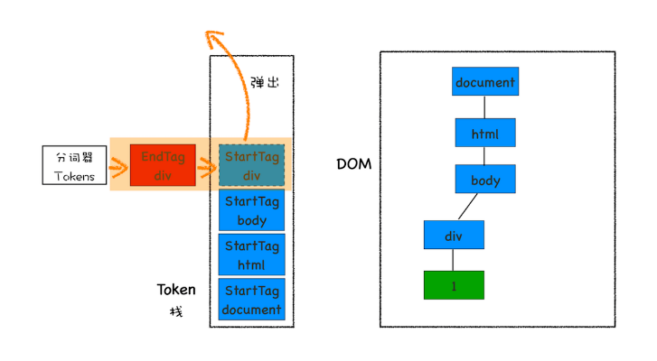

# DOM 树(Document Object Model)

DOM 用来表述 HTML 内部结构（HTML 文件字节流无法被渲染引擎理解）

## DOM 树的生成

1. 网路进程不断加载 HTML 文件 => 渲染进程 => html 解析器 => html 字符串
2. 通过分词器转化为 token
3. 与此同时不断生成 DOM 节点
4. 生成 DOM 树

## Javascript 的加载与执行都会阻塞 DOM 解析

解决方法：

- async：加载完后立即执行
- defer：DOMContentLoaded 事件前执行

### 什么时候使用 async 和 defer

js 需要进行 DOM 操作时使用 defer

## CSS 也会影响 DOM 的生成

CSS 阻塞 Javascript 执行（因为 Javascript 可能会操纵 CSSOM，执行脚本前会先下载 CSS 文件并解析）
