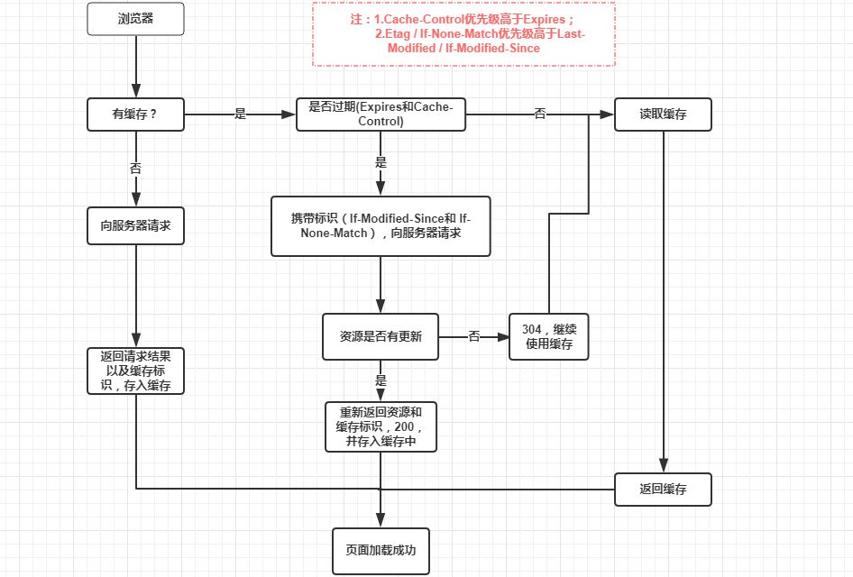

# 强制缓存与协商缓存

强制缓存优先于协商缓存进行，若强制缓存(Expires 和 Cache-Control)生效则直接使用缓存，如不生效则进行协商缓存(Last-Modified / If-Modified-Since 和 Etag / If-None-Match)，协商缓存由服务器决定是否使用缓存，若协商缓存失效，那么代表该请求的缓存失效，重新获取请求结果，再存入浏览器缓存中；生效则返回 304，继续使用缓存，主要过程如下：

## 强制缓存

向浏览器缓存查找请求结果

### Expires

Expires 是 Http/1.0 控制网页缓存的字段，在 Http/1.1 后已被 Cache-Control 替代（因为时间误差）

### Cache-Control

Cache-Control 优先级比 Expires 高

- public：所有内容都被缓存（客户端及代理服务器）
- private：所有内容只有客户端缓存
- no-cache: 客户端缓存内容，是否使用缓存需通过协商缓存进行
- no-store: 不做缓存
- max-age=xxx: 缓存内容在 xxx 秒后失效

## 协商缓存

强制缓存失效后，浏览器携带缓存标识向服务端发起请求，服务端根据缓存标识决定是否使用缓存

- Last-Modified / If-Modified-Since
- Etag / If-None-Match (优先级高于上者)
