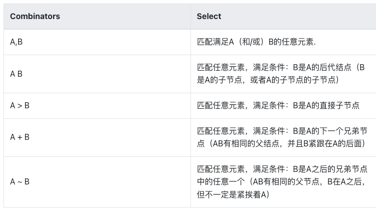
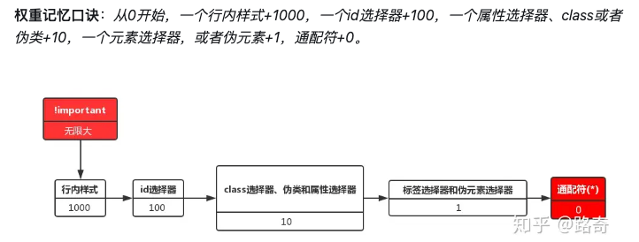

# CSS 选择器

## 简单选择器

- Element Selector
- Class Selector
- ID Selector
- Universal Selector(\*)
- Attr Selector
- Combinators：

## 属性选择器

- [attr=val]

## 伪类及伪元素

- Pseudo-class
- Pseudo-element

## 权重

- !important > 行内样式 > id > (class | attr | pseudo-class) > (element | pseudo-element) > \*
- 如果两条样式都使用!important，则权重值高的优先级更高

