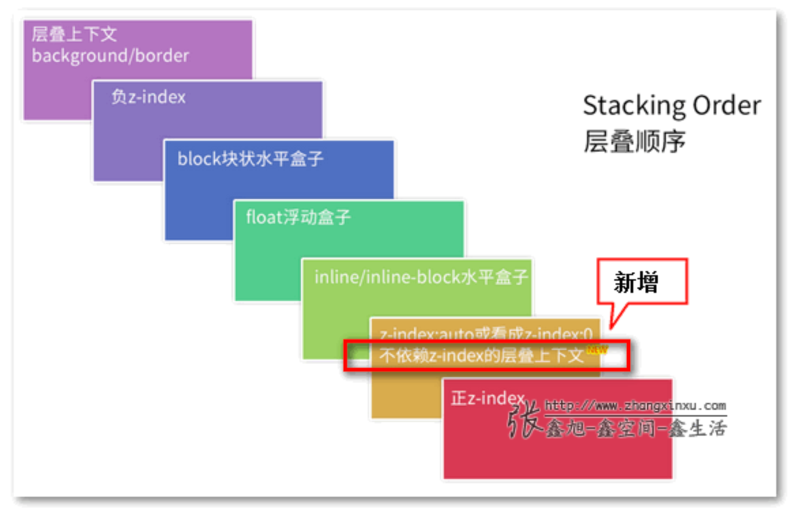

# 层叠上下文

对 HTML 元素的三维构想

- 优先比较父级层叠上下文的层叠顺序，再在父级层叠上下文中按顺序进行层叠。

# 层叠等级

层叠上下文(background/border) < z-index 负数 < block 元素 < 浮动元素 < inline/inline-block 元素 < z-index 正数

在同一层叠上下文中，元素在 Z 轴上的上下顺序

- 层叠等级的比较只有在当前层叠上下文元素中才有意义

# 如何产生层叠上下文

- HTML 中的根元素(根层叠上下文)
- z-index 值为数值的定位元素(传统层叠上下文)
- ## 其他 CSS3 属性
  - flex (flex) 容器的子元素，且 z-index 值不为 auto.
  - 元素的 opacity 值不是 1.
  - 元素的 transform 值不是 none.
  - 元素 mix-blend-mode 值不是 normal.
  - 元素的 filter 值不是 none.
  - 元素的 isolation 值是 isolate.
  - will-change 指定的属性值为上面任意一个。
  - 元素的-webkit-overflow-scrolling 设为 touch.

# 相关文档

[相关文档](https://www.zhangxinxu.com/wordpress/2016/01/understand-css-stacking-context-order-z-index/)
