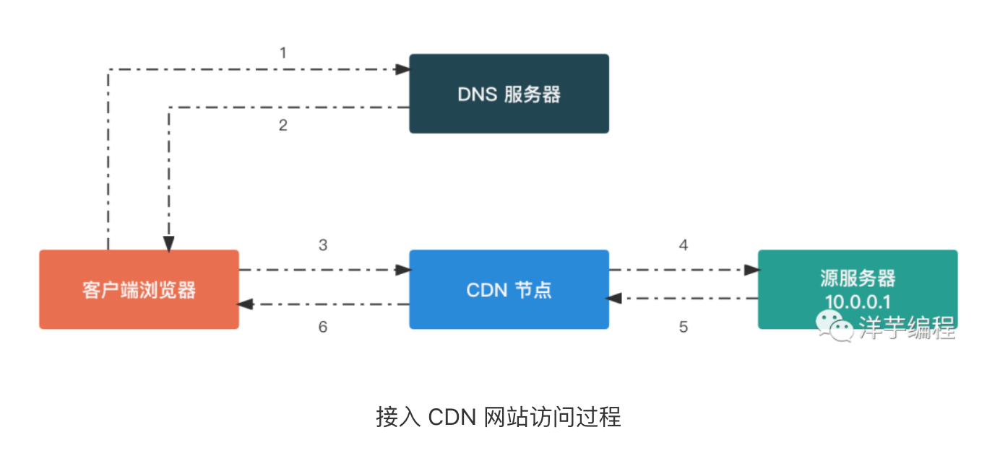

# CDN 原理

DNS 解析域名时返回离用户最近的 CDN 节点服务器地址

1. 客户端浏览器输入网址，如 https://www.example.com/logo.png

2. 浏览器请求 DNS​ 服务器，查询 https://www.example.com/logo.png​ 对应的服务器 IP 地址

3. **DNS 解析遇到 CNAME 记录**，所以这里 DNS​ 服务器会返回 CDN​ 服务商提供的 CDN 节点服务器的地址

4. 浏览器向 CDN​ 节点服务器发起 TCP 连接

5. 浏览器通过建立的 TCP​ 连接发送 HTTP 请求图片文件

6. CDN​ 节点服务器使用内部专用 DNS​ 解析出域名对应的源服务器 IP 地址

7. CDN 节点服务器向源服务器发起 TCP 连接

8. CDN​ 节点服务器通过建立的 TCP​ 连接发送 HTTP 请求图片文件

9. CDN 节点服务器接收到图片文件后，在本地保存一份，作为缓存使用，减少源服务器的回源流量

10. CDN 节点服务器向浏览器发送图片文件

11. 浏览器将接收到的图片文件渲染，完成本次请求

# 相关文档

[CDN 原理入门](https://www.51cto.com/article/750758.html)
