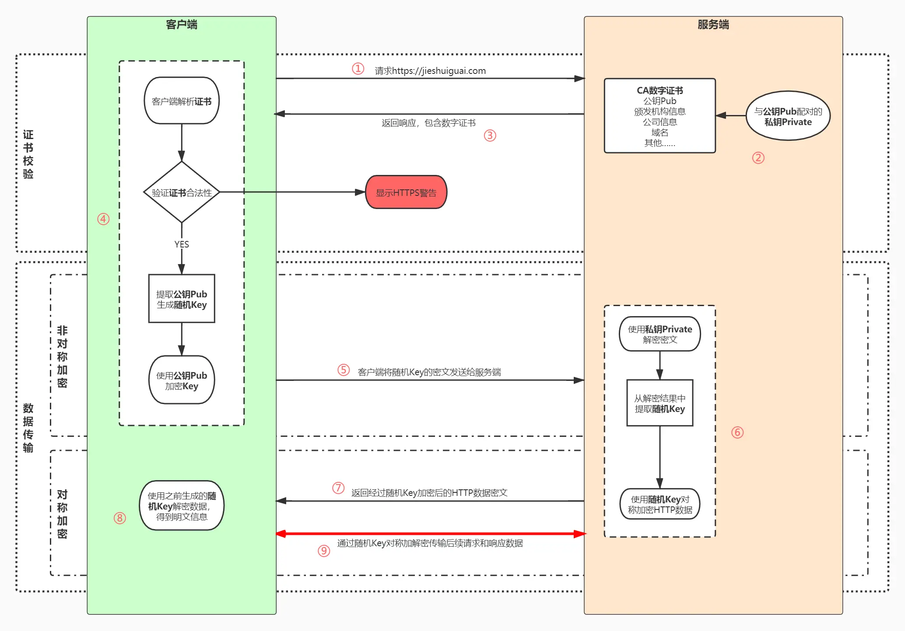

# https

将 HTTP 的数据包再通过 SSL/TLS 加密后传输

# 对称加密与非对称加密

## 对称加密

- 一个密钥，服务端与客户端无法完成安全的密钥交换

## 非对称加密

- 一对私钥、公钥，公钥会在互联网上传输
- 两对公钥、私钥可以保证安全性，但是非对称加解密耗时远大于对称加密，性能差

## 对称加密 + 非对称加密

1. 服务端有非对称加密的公钥 A1, 私钥 A2
2. 客户端发起请求，服务端返回公钥 A1
3. 客户端随机生成对称加密的密钥 K，用服务端的公钥 A1 加密后发送给服务端
4. 服务端用私钥 A2 解密，得到对称加密的密钥 K，完成了安全的对称密钥交换
5. 之后通信使用密钥 K 进行对称加解密

## CA 数字证书

### 中间人攻击

客户端无法确认收到的公钥是否来自真的服务端

### 流程

数字签名校验，确认证书未被篡改

1. CA 机构拥有自己的一对公钥和私钥
2. CA 机构在颁发证书时对证书明文信息进行哈希
3. 将哈希值用私钥进行加签，得到数字签名

**明文数据和数字签名组成证书传递给客户端**

1. 客户端得到证书，分解成明文 Text 和加签 Sig1
2. 用公钥解签获得 Sig1 对应的哈希 T
3. 用证书中的哈希算法对明文 Text 哈希得到哈希值 H
4. 当 H 与 T 相同时证明数字证书可信

# 相关文档

[相关文档](https://juejin.cn/post/6844904127420432391)
