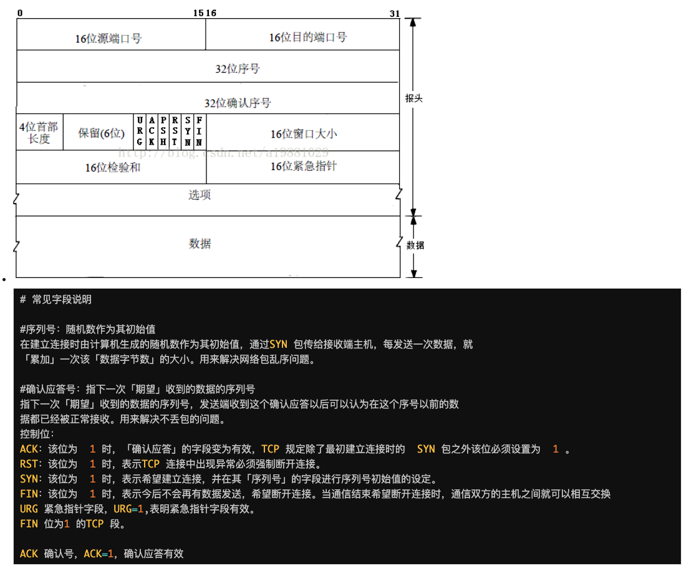

# TCP 报文简介

TCP 是一种面向连接的、可靠的传输层通信协议

# TCP 协议的特点

- 面向连接的: 需要建立连接
- 可靠交付: 确认重传、无差错、不丢失、不重复
- 面向字节流: 从进程流入流出的字节序列。有序的

# TCP 报文格式

# TCP 三次握手

1. 客户端 => 服务端：请求建立连接 SYN = 1, 同时生成一个随机序列号 seq1
2. 服务端 => 客户端：建立 TCP 连接，产生自己的序列号 seq2，给客户端发送有效确认 ACK = 1, 并发送确认序号告知下次从哪里获取序列号 ack = seq1 + 1
3. 客户端 => 服务端：确认收到，发送有效确认位 ACK = 1，确认序列号 ack = seq2 + 2，完成三次握手。前 2 次不带数据，第三次可以带数据

# TCP 四次分手

1. 客户端 => 服务端：请求释放连接 FIN = 1, 同时带上序列号 seq1
2. 服务端 => 客户端：确认收到 ACK = 1, 同时带上 ack = seq + 1
3. 服务端 => 客户端：释放连接 FIN = 1, 同时带上 ack = seq + 1 及自己的当前序列号 seq2
4. 客户端 => 服务端：确认收到 ACK = 1, 同时带上 ack = seq2 + 2

# 常见面试问题

1. 为什么需要四次挥手？

- 客户端向服务端发送 FIN 包时，仅代表客户端不再发送数据还能接收数据
- 服务端接收到 FIN 包时，先回一个 ACK 应答，服务端可能还有数据需要处理和发送，不再发送数据后才发送 FIN 包

2. 为什么是三次握手？不是两次、四次？

- 三次握手可以同步两端初始序列号， 保障可靠传输
- 阻止重复连接的建立，避免资源浪费（两次握手服务端无法确认客户端是否接收到 ACK 确认信号）

3. TCP 是一个可靠传输协议，如何保证可靠

- 重传机制：超时重传、快速重传、SACK 方法
  - [相关文档](https://coolshell.cn/articles/11564.html#%E8%B6%85%E6%97%B6%E9%87%8D%E4%BC%A0%E6%9C%BA%E5%88%B6)
  - 超时重传：时间驱动，timeout 重传
  - 快速重传：数据驱动，无需等待 timeout，发送端接收到三个相同的 ACK 就重传
  - SACK：解决了前两种无法确定重传数据的问题，在 TCP 头部加 SACK 信息，告知发送端接收到了哪些数据
- 滑动窗口：指定无需等待响应，可以发送数据的最大值
- 流量控制：窗口大小为 0 时阻止发送方继续发送数据，直到窗口非 0
- 拥塞控制：慢启动、拥塞避免
