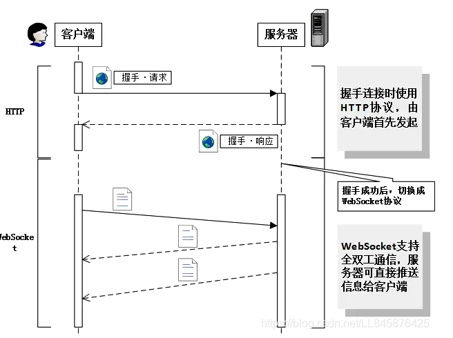

# 为什么需要 websocket

- 建立在 TCP 上的新协议
- 实现客户端与服务端的双向通信，只需要连接一次就可以相互传输
- 适用实时场景，如聊天室需要查询服务端状态，轮询效率低，需不断重复建立 http 连接（request => response）

# WS 与 HTTP 的不同

- WS 握手阶段使用 http，定义了一些新的 header
- WS 连接无法通过中间人转发
- WS 建立连接后，双方可以随时通信
- WS 建立连接后，双方数据传输使用帧，不再需要 Request 消息，消息可以分片传输，传输效率高
- WS 数据帧有序

# 流程

1. 客户端发送 websocket 握手请求
   - header 包含：`Connection: Upgrade`, `Upgrade: websocket`
2. 服务端响应状态码 101 Switching Protocols

# 优缺点

优点

1. 双向通信：双方都可主动通信
2. 传输效率高：不需要反复建立连接
3. 没有同源限制
4. 数据量轻：握手时需携带 header，后续数据通信无需再携带
