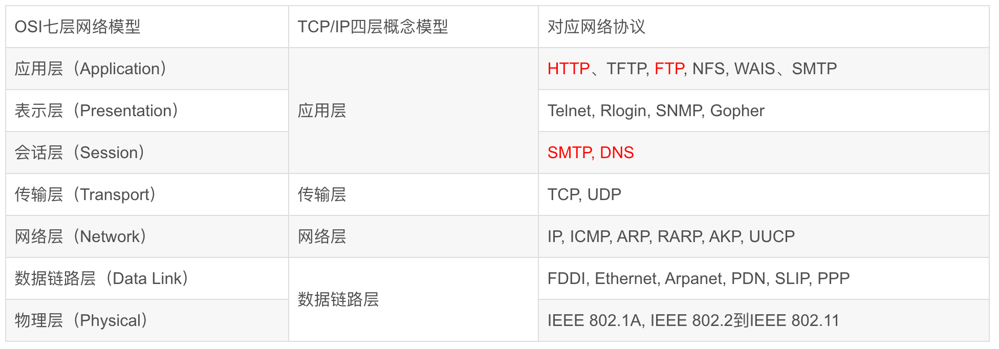

# OSI 7 层模型与 TCP/IP 4 层模型

## OSI 7 层

- 应用层
- 表示层
- 会话层
- 传输层
- 网络层
- 数据链路层
- 物理层

## TCP 4 层

- 应用层
- 传输层
- 网络层
- 数据链路层

# OSI 7 层模型与 TCP/IP 4 层模型的区别

OSI 模型为学术上的标准，TCP/IP 4 层模型为事实上的国际标准，在现实生活中广泛使用
