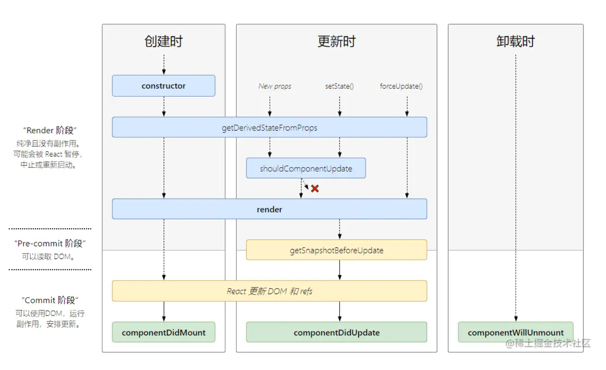

# React 生命周期

- render 阶段

  - 挂载时
    - Constructor
    - getDerivedStateFromProps
    - render
  - 更新时
    - getDerivedStateFromProps
    - shouldComponentUpdate
    - render

- commit 阶段
  - 挂载时
    - componentDidMount
  - 更新时
    - componentDidUpdate
  - 卸载时
    - componentWillUnmount

