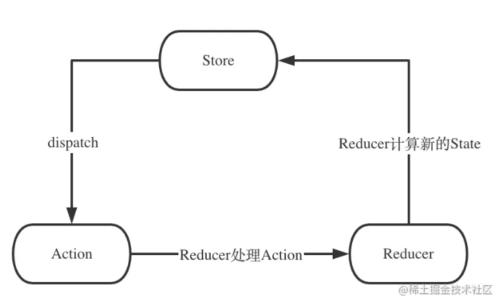

[相关文档](https://juejin.cn/post/6845166891682512909)

# 何为 Redux

简单的状态机（没有 view 层），发布订阅模式


# 手写 Redux

```js
function createStore(reducers) {
  let state;
  const listeners = [];

  function getState() {
    return state;
  }
  function subscribe(cb) {
    listeners.push(cb);
  }
  function dispatch(action) {
    state = reducers(state, action);
    listeners.forEach((listener) => {
      listener();
    });
  }
  return {
    getState,
    subscribe,
    dispatch,
  };
}
```

# 手写 combineReducers

```js
function combineReducers(reducerMap) {
  const reducerKeys = Objet.keys(reducerMap);
  const reducer = (state = {}, action) => {
    const newState = {};
    reducerKeys.forEach((key) => {
      const prevState = state[key];
      newState[key] = reducerMap[key](prevState, action);
    });
    return newState;
  };
  return reducer;
}
```

# 手写 applyMiddleware

## enhancer

applyMiddleware 返回 enhancer，接受 createStore 为参数，返回一个 newCreateStore

## middleware

增强 dispatch

- 一个中间件接收 store 作为参数，会返回一个函数
- 返回的这个函数接收老的 dispatch 函数作为参数，会返回一个新的函数
- 返回的新函数就是新的 dispatch 函数，这个函数里面可以拿到外面两层传进来的 store 和老 dispatch 函数

```js
function applyMiddleware(middleware) {
  function enhancer(createStore) {
    function newCreateStore(reducer) {
      const store = createStore(reducer);
      const { dispatch } = store;
      const newDispatch = middleware(store)(dispatch);
      return {
        ...store,
        dispatch: newDispatch,
      };
    }
    return newCreateStore;
  }

  return enhancer;
}
```

# 支持多个 middleware

```js
function compose(...func) {
  return func.reduce(
    (a, b) =>
      (...args) =>
        a(b(...args))
  );
}
function applyMiddleware(...middlewares) {
  function enhancer(createStore) {
    function newCreateStore(reducer) {
      const store = createStore(reducer);
      const { dispatch } = store;
      const chain = middlewares.map((middleware) => middleware(store));
      const newDispatchGen = compose(...chain);
      const newDipatch = newDispatchGen(dispatch);
      return {
        ...store,
        dispatch: newDispatch,
      };
    }
    return newCreateStore;
  }

  return enhancer;
}

function createStore(reducers, enhancer) {
  if (enhancer && typeof enhancer === 'function') {
    const newCreateStore = enhancer(createStore);
    const newStore = newCreateStore(reducers);
    return newStore;
  }

  let state;
  const listeners = [];

  function getState() {
    return state;
  }
  function subscribe(cb) {
    listeners.push(cb);
  }
  function dispatch(action) {
    state = reducers(state, action);
    listeners.forEach((listener) => {
      listener();
    });
  }
  return {
    getState,
    subscribe,
    dispatch,
  };
}
```
