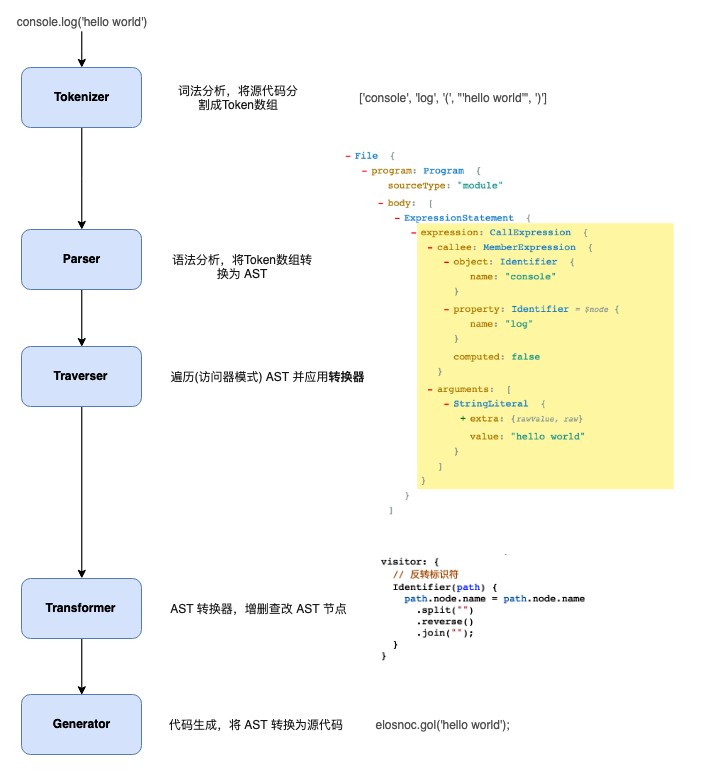
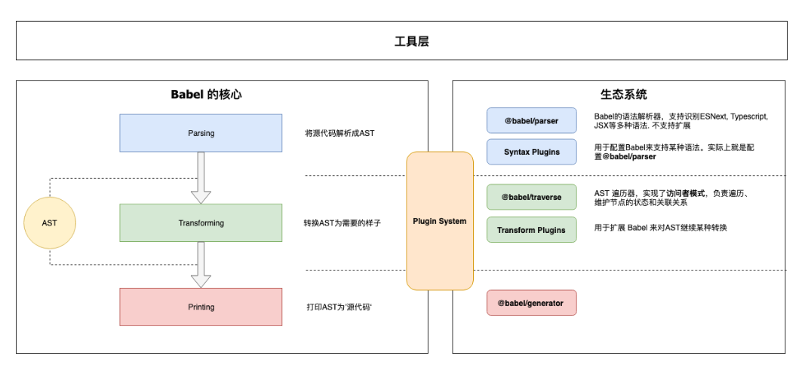

# Babel 处理流程



# Babel 的架构



1. 核心
   @babel/core

- 负责加载处理配置
- 加载插件
- 调用 @babel/parser 进行语法解析生成 AST
- 调用 @babel/traverse 遍历 AST，应用插件对 AST 进行转换
- 调用 @babel/generator 生成代码

2. 核心周边

- @babel/parser: 将源码解析为 AST
- @babel/traverse: 遍历转换 AST
- @babel/generator: 将 AST 转换为源代码

3. 插件

- 语法插件(@babel/plugin-syntax-\*): 只是用来开启或配置 Parser 的某个功能，一般无需关心
- 转换插件(@babel/plugin-transform-\*): 对 AST 进行转换
- 预定义集合(@babel/presets-\*): 插件集合或者分组，方便用户对插件进行管理和使用，如 preset-env 包含所有标准的新特性，preset-react 包含所有 react 相关的插件

4. 插件开发辅助

- @babel/template: babel 模版引擎，可将字符串直接转换为 AST
- @babel/types
- @babel/helper-\*
- @babel/helper

# 访问者模式

- 进行统一的遍历操作，插件只需定义关注的节点类型，访问者访问到对应节点时就调用插件
- 深度优先遍历

# 插件调用顺序

- Plugins run before Presets
- Plugins ordering is frist to last
- Presets ordering is reversed

```json
{
  "plugins": ["transform-decorators-legacy", "transform-class-properties"],
  "presets": ["@babel/preset-env", "@babel/preset-react"]
}
```

transform-decorators-legacy => transform-class-properties => @babel/preset-react => @babel/preset-env

# 插件实践

```js
// 接受一个 babel-core 对象
export default function (babel) {
  const { types: t } = babel;
  return {
    pre(state) {
      // 前置操作，可选，可以用于准备一些资源
    },
    visitor: {
      // 我们的访问者代码将放在这里
      ImportDeclaration(path, state) {
        // ...
      },
    },
    post(state) {
      // 后置操作，可选
    },
  };
}
```

# 相关文档

[相关文档](https://bobi.ink/2019/10/01/babel/)
