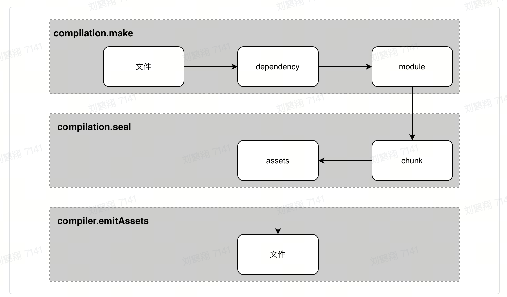
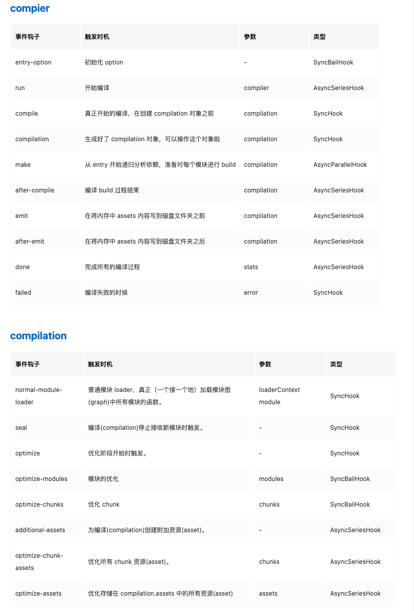

# webpack 工作流程

## 初始化阶段

1. 读取用户配置
2. 创建 compiler 对象
3. 遍历用户定义的 plugin，执行 plugin 上的 apply 方法
4. 加载内置插件
5. 执行`complier.run`开始编译，创建`compilation`对象
6. 调用`compilation.addEntry`，确定编译入口

## 编译阶段

构建阶段围绕 module 展开: `module => ast => dependencies => module`，生成模块内容及模块依赖关系

1. 从入口文件开始构建 module
2. 通过 loader 编译 module => js
3. 调用 acorn 将 js => ast
4. 遍历 AST 找到依赖，加入到 module 的依赖列表中
5. 遍历完成后再递归处理依赖
6. 所有依赖处理完成后结束构建阶段

## 输出阶段

生成阶段围绕 chunk 展开

1. 执行`compilation.seal`，根据入口/动态引入规则和模块间的依赖关系生成 chunk
2. 执行`compilation.emitAssets`输出文件

## 资源形态流转



## 简要概括

1. 初始化阶段，加载用户配置，生成 compiler 对象，遍历注册的 plugin，调用 apply 方法激活，加载内置插件
2. 调用`complier.run`开始编译，生成`complilation`对象，确认编译入口，进入编译阶段
3. 从入口文件开始生成`module`，调用 loader 编译 module，调用 acron 生成 ast，找到`module`依赖，再递归编译依赖
4. 编译结束后，确认了模块及模块间依赖关系，根据 entry/动态引入等规则调用`complilation.seal`生成 chunk
5. 调用 `compilation.emitAssets`输出文件

# webpack 核心

- Entry
  入口
- Module
  模块，一个文件就为一个模块，从 entry 开始递归找出所依赖的模块
- Loader
  构建阶段，对模块进行编译转换
- Plugin
  webpack 事件触发调用，注入扩展逻辑改变构建结果
- Output
  输出结果

# webpack 插件机制

## compiler 和 compilation

- Compiler（人）编译管理器，贯穿了整个 Webpack 从启动到关闭的生命周期
- Compilation（大脑）只是代表了单次编译，只要文件有改动，compilation 就会被重新创建。

## 常用钩子

- compiler.hooks.compilation ：
  - 时机：启动编译创建出 compilation 对象后触发
  - 参数：当前编译的 compilation 对象
  - 示例：很多插件基于此事件获取 compilation 实例
- compiler.hooks.make：
  - 时机：正式开始编译时触发，准备创建 compilation 对象爱过你
  - 参数：同样是当前编译的 compilation 对象
  - 示例：webpack 内置的 EntryPlugin 基于此钩子实现 entry 模块的初始化
- compilation.hooks.optimizeChunks ：
  - 时机： seal 函数中，chunk 集合构建完毕后触发
  - 参数：chunks 集合与 chunkGroups 集合
  - 示例： SplitChunksPlugin 插件基于此钩子实现 chunk 拆分优化
- compiler.hooks.done：
  - 时机：编译完成后触发
  - 参数： stats 对象，包含编译过程中的各类统计信息
  - 示例： webpack-bundle-analyzer 插件基于此钩子实现打包分析

## 改变编译结果

- compilation.addModule：添加模块，可以在原有的 module 构建规则之外，添加自定义模块
- compilation.emitAsset：直译是“提交资产”，功能可以理解将内容写入到特定路径
- compilation.addEntry：添加入口，功能上与直接定义 entry 配置相同
- module.addError：添加编译错误信息

## 编写一个插件

```js
class MyExampleWebpackPlugin {
  // 定义 `apply` 方法
  apply(compiler) {
    // 指定要追加的事件钩子函数
    compiler.hooks.compile.tapAsync('afterCompile', (compilation, callback) => {
      console.log('This is an example plugin!');
      console.log(
        'Here’s the `compilation` object which represents a single build of assets:',
        compilation
      );

      // 使用 webpack 提供的 plugin API 操作构建结果
      compilation.addModule(/* ... */);

      callback();
    });
  }
}
```

## 比较重要的事件钩子



# webpack loader 机制

从右到左地被依次运行

# 相关文档

[webpack - 工作流程原理](https://juejin.cn/post/7104936845682671630)
[一文吃透 Webpack 核心原理](https://bytedance.larkoffice.com/wiki/wikcnk44WKREtZcc4xkAtUve8Eb)
