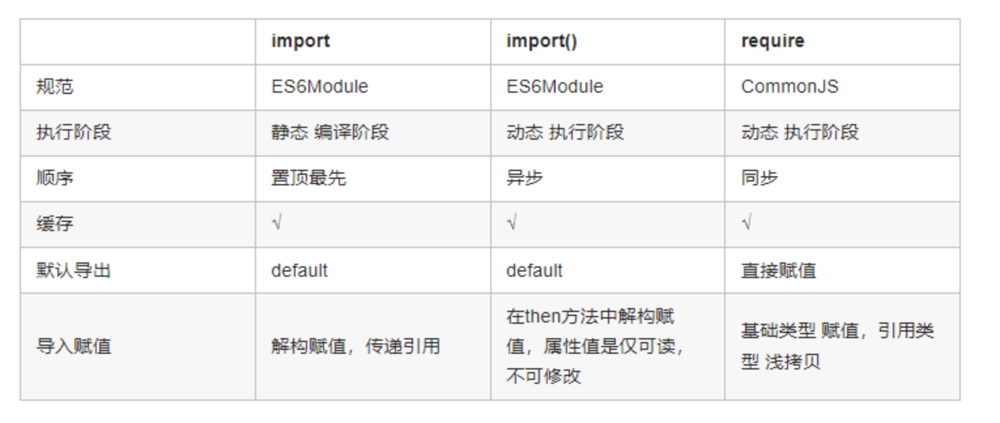

# 什么是模块

- 将一个复杂的程序依据一定的规则(规范)封装成几个块(文件), 并进行组合在一起
- 模块的内部数据与实现是私有的, 只是向外部暴露一些接口(方法)与外部其它模块通信

# 模块化规范

## CommonJS

- module.exports 和 require
- 加载模块是同步的，不适合浏览器环境，在浏览器需将模块提前编译打包
- require 的值是 export 的值的拷贝

## ES6

- export 和 import
- ES6 对外的接口只是一种静态定义，代码在静态解析阶段就能生成(无需运行)

## ES6 与 CommonJS 不同点

1. CommonJS 输出的是值的拷贝，ES6 输出的是值的引用
2. CommonJS 模块依赖关系是运行时确定，ES6 在编译时即可确定
   
