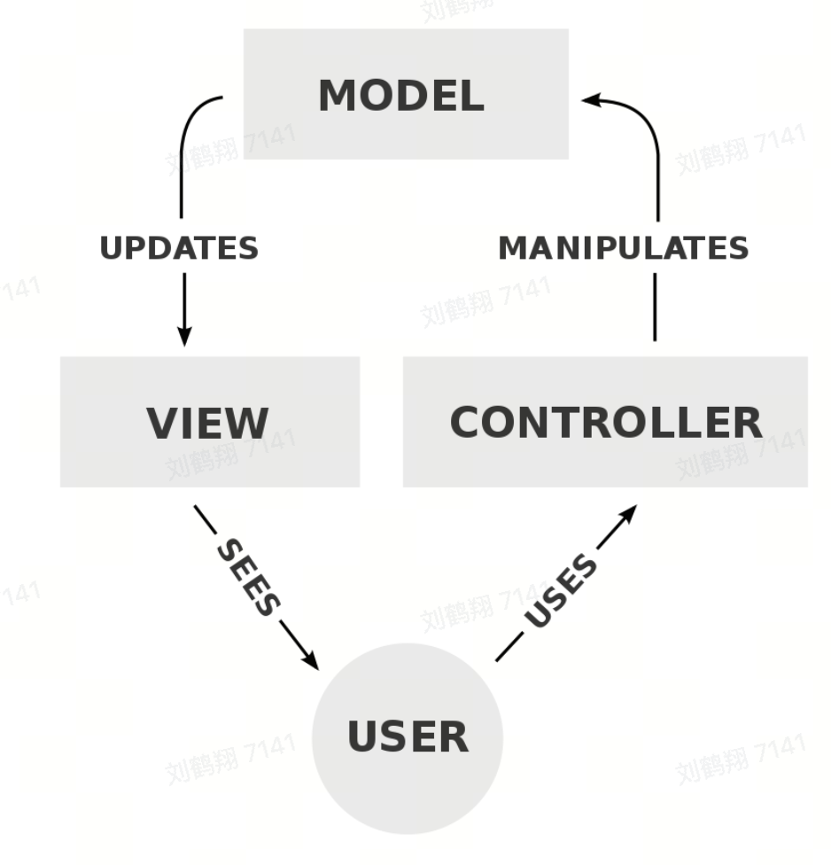
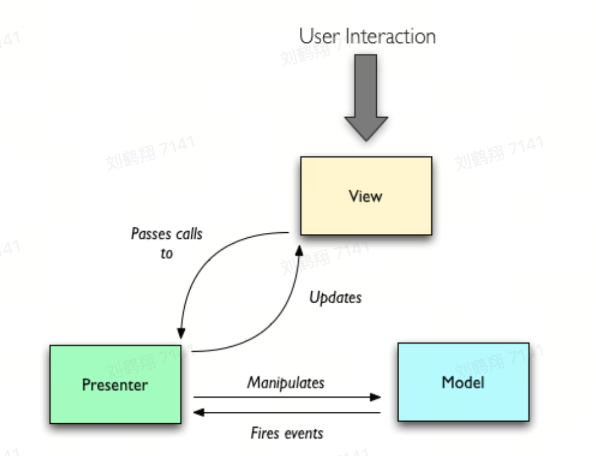

# MVC

- view 层与 model 层一一绑定，难以复用和迭代业务
  

# MVP

- view 层与 model 层没有关系，通过 Presenter 中间层交互
- Presenter 层比较复杂，没有绑定数据，所有数据都需 Presenter 手动写方法同步
  

# MVVM

- ViewModel 层把 Model 层和 View 层的数据同步自动化了，解决了 MVP 中数据同步困难的问题
- 双向数据绑定 (根据数据的变化实时渲染)
