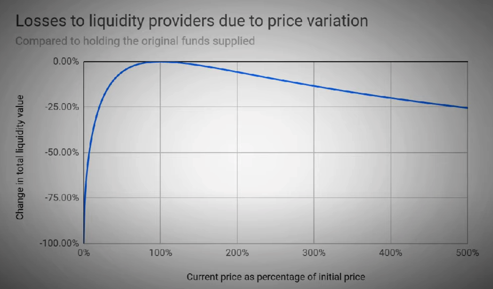

# DEX

## DEX VS CEX

CEXs offer faster transactions and higher liquidity, but users give up custody of their assets and face security risks. DEXs provide more control over funds（P2P） and enhanced security but have lower liquidity and may involve impermanent loss risks.

## DEX Downsides

- Low liquidity（低流动性）
- 不能跨链交易（可以 Wrap）

## Order Book(订单簿)

依赖第三方机构(市商)

- 需要把资产放到第三方机构，由第三方机构代理完成交易

## Liquidity Pool

- 通过智能合约，弥补 DEX 流动性不足的问题
- 交易随时发生，不需要挂单
- 通过多个 Liquidity Pool **Routing**, 可以实现多种 token 的交易
- 越大的流动池，价格越稳定

### Liquidity Provider（流动性提供者）

- 流动性提供者赚取交易费

### Arbitrage Trader（套利交易者）

- 利用流动池价格与其他 CEX 平台价格(如 coinbase)的价差套利赚差价
- 帮助流动池价格与其他平台价格匹配，促进价格稳定

## AMM(Automated Market Maker)

流动池背后的算法

### Constant Product Market Maker(CPMM)

大宗交易会产生价格滑点

`x * y = k`

### Constant Sum Market Maker(CSMM)

不会受交易影响，但会散失流动性

`x + y = k` `Px = x / y` `Py = y / x`

## impermenent loss

不同平台的价差导致

## blockchain bridge

eg: WETH, wrapper any other crypto to ERC-20 Compatible

- Centralized
- Decentralized (Smart Contract)
